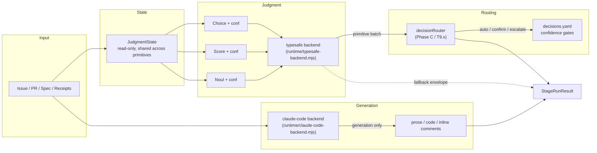

# Harness 化架构设计：Factory → AgentHarness

状态：0.3.0 统一 Agent Runtime（Slice C）落地，`BACKEND_DESCRIPTORS` 只剩 `claude-code`，`embedded` / `codex-cli` / `pi-cli` 已从注册表中移除。本节按当前实现状态记录。

## 1. 背景与动机

旧实现曾在每个 agent 阶段创建独立 `Agent` 实例。
该路径已经删除，所有 LLM 阶段现在统一通过 issue 级 Harness session 和角色 lane 执行。
旧 trace 文件不再是运行时入口，JSONL session 负责持久化对话与审计记录。
systemPrompt 与动态内容曾混在一起（已在前一轮修复中分离），但缺少架构级约束防止回归。

目标（来自需求方）：

- 每个 issue 是一个独立 session。
- 同一 session 内所有 agent 的上下文共享、连续。
- 每个 agent 都是多轮对话。
- 整个系统是 harness 架构，每个 agent 是一个 harness agent。

## 2. SDK 能力盘点（@earendil-works/pi-agent-core 0.85.1）

SDK 已内置完整的 harness 运行时，无需自研：

- `AgentHarness.create({ session, models, model, tools, systemPrompt, resources, hooks, compaction, ... }, context)` 创建 harness。
- `Session` 是持久化对话树，entry 类型有 `message` / `compaction` / `branch_summary` / `custom`。
- 存储后端：`MemorySessionRepo`（测试）、`JsonlSessionRepo`（内置、文件持久化）、SQLite 后端（独立包 `@earendil-works/pi-session-backend-sqlite-node`）。
- `Lane` 是 session 内的一条 agent 会话线：独立配置（model / thinkingLevel / activeTools），共享 session entries。
- `lane.prompt() / steer() / followUp() / skill() / compact() / navigateTree() / watch()` 提供多轮驱动与观测。
- Hooks：`transform_context`（重写 messages/systemPrompt）、`before_run`、`before_tool` / `after_tool`（策略拦截）、`after_response`、`before_compaction`。
- `EntryProjector`：把 custom entry 投影为模型可见上下文，是跨 agent 传递产物的关键机制。
- Compaction：阈值触发的自动上下文压缩（`DEFAULT_COMPACTION_SETTINGS`）。
- `Skills` / `PromptTemplates` 作为 resources 注入，`formatSkillsForSystemPrompt` 生成标准 system prompt 块。
- chord `Context` 由 SDK 转发（`BACKGROUND_CONTEXT`），无需新增依赖。

## 3. 目标架构映射

| 现状 | Harness 化后 |
| --- | --- |
| `FactoryOrchestrator.runForIssue` 内每 stage 新建 Agent | 每 issue 一个 `Session`（JsonlSessionRepo，`FACTORY_STATE_DIR/sessions/issue-<n>/`） |
| `new XxxAgent(ctx).run()` | `harness.lane('triage' \| 'spec-product' \| 'spec-tech' \| 'review-spec' \| 'implementation' \| 'review-pr' \| 'verify-behavior')` + 多轮 `lane.prompt()` |
| systemPrompt = role + skillBody 字符串拼接 | Lane 创建时一次性注入，`transform_context` hook 负责运行期策略，systemPrompt 永不变异 |
| 阶段产物靠 staged files 传递（pr_diff.txt / spec_product.md） | `custom entry` + `EntryProjector` 投影给后续 lane；staged files 保留为兼容通道 |
| `.factory/state` JSON checkpoint | 保留，仍是状态机权威（labels / transitions / attempts）；session 是对话与证据的权威 |
| `.factory/traces/*.json` | 由 session JSONL 天然取代，退役 |
| `runLlmAgent` 的 parse 兜底与 orchestrator self-heal | 保留现有 `parseImplementationResult` + `MAX_PARSE_FAILURE_HEALS` 自愈；后期可上移到 `after_response` hook |

上下文分层原则（架构级约束，已有契约测试锁定）：

1. systemPrompt：不可变角色定义 + skill rubric，注入一次。
2. userPrompt（turn 1）：任务定义（issue 身份 + 输出契约），同一 issue 跨 attempt 字节稳定。
3. contextTurns / tool results / custom entries：attempt 级动态内容，只向后追加。

## 4. 关键技术风险（PoC 必须验证）

1. **ModelAdapter 兼容性（最高风险）**：`AgentHarness` 要求 `models: Models` + `model: Model<Api>`，内部走 `models.streamSimple`。
   现有 AnthropicAdapter 经 `pi-ai/compat` 定制 `baseUrl` / `headers`（MiniMax 等 Anthropic 兼容端点）。
   PoC 必须验证 harness 对自定义端点的流式调用、重试、cacheRetention 行为与现有 `Agent` 路径一致。
2. **工具签名适配**：`AgentHarnessTool.execute(toolCallId, params, onUpdate, toolContext, invocation, context)` 比现有 `{name, description, execute(args, ctx)}` 多四个参数。
   需要一个 adapter 层（`toHarnessTools`），并把 `AgentContext` 作为 `toolContext` 注入。
3. **轮次与超时控制**：现有 40 turns / 15 分钟上限靠 `agent.subscribe` + `setTimeout` 实现。
   harness 侧需用 lane 事件（`turn_end`）+ `lane.abort()` 重实现，并验证 `OperationResultRecord.status` 语义。
4. **会话恢复**：daemon 重启后 `AgentHarness.create` 返回 `open: OpenOperation[]`，需验证未完成 operation 的 resume 行为与现有 checkpoint 自愈逻辑（`shouldSelfHealImplAttemptLimit`）不冲突。

## 5. 迁移阶段

- **Phase 0（PoC，不动生产代码）**：`AgentHarness` + `MemorySessionRepo` + 现有 AnthropicAdapter 构建的 model，跑通单 lane（triage）。
  验证流式、tools adapter、自定义端点、abort/超时。
- **Phase 1（shim 迁移）**：引入 issue 级 `JsonlSessionRepo` 与 harness 工厂。
  `runLlmAgent` 内部改为 lane 执行，对外签名不变，所有 agent 获得 session 持久化与上下文连续。
- **Phase 2（显式 lane 化）**：每个 agent 迁到显式 lane；阶段产物改走 custom entries + EntryProjector；staged files 降级为兼容通道。
- **Phase 3（策略上移）**：parse 兜底 / self-heal / 工具拦截迁到 hooks；配置 compaction；退役 traces 与 `Agent` 直连路径。
- **Phase 4（面板集成）**：control-panel 读取 session transcript，可视化每个 issue 的多 agent 连续对话。

每阶段完成后跑全量测试 + 重建 dist bundle，独立可回滚。

## 6. 待确认决策

1. **存储后端**：推荐 JSONL（内置、零新依赖、与现有文件型 checkpoint 风格一致）；SQLite 后端需引入新包，仅在需要并发查询 transcript 时再考虑。
2. **迁移方式**：推荐渐进式（Phase 1 shim 保持 `runLlmAgent` 签名），不建议大爆炸重写。
3. **PoC 环境**：Phase 0 需要真实 LLM 凭据（`ANTHROPIC_AUTH_TOKEN` / `ANTHROPIC_BASE_URL` / `ANTHROPIC_MODEL`）才能验证风险 1；无凭据环境下只能以本地 stub adapter 验证接线，端点兼容性需在目标环境复验。

## 7. 当前落地状态

### Harness 主路径回滚

0.3.0 Slice C 把 Harness 主路径替换为 [`src/core/agent-runtime.ts`](../src/core/agent-runtime.ts) 的 dispatcher。下述文件在 0.3.0 已被删除（在 CHANGELOG 0.3.0 条目下记录）：

- `src/core/harness.ts` —— 不存在
- `src/core/llm-agent.ts` —— 不存在
- `src/core/jev-primitives.ts` —— 不存在（untracked,2026-09 清除）

`HarnessLlmEngine` / `LegacyLlmEngine` / `ModelAdapter.buildRuntime()` 都不再存在。`src/core/typesafe-selection.ts::claudeFallbackRuntime` 提供 fallback 路径，dispatcher 是所有 agent stage 的唯一入口。

`scripts/poc-harness.mjs` 保留为 `@earendil-works/pi-agent-core` 选型的兼容性 PoC，不是运行时入口；任何当前 stage 都不会走它。

### 保留边界

- Harness session 目录必须视为敏感运行数据，不应提交或开放给不受信任的面板用户。
- 不同 lane 共享同一个 issue session，但跨 lane 的领域产物仍应通过结构化 checkpoint 或投影传递，而不是依赖自由文本历史。
- 真实兼容端点的流式行为和 provider 限制仍需在部署环境使用 `FACTORY_POC_REAL=1` 验证。

## 4. 统一 Agent Runtime(Slice A/B)

`src/core/agent-runtime.ts` 在 Harness 之上抽出 `AgentRuntime` 调度层,
让 factory 可以走同一条 `StageRunRequest → StageRunResult` 契约
驱动 `embedded` (Harness) 或外部 CLI (Claude Code / Codex / Pi)。

### 4.1 契约

| 实体 | 字段 |
| --- | --- |
| `BackendId` | `claude-code`（0.3.0 Slice C 后唯一注册项；`embedded` / `codex-cli` / `pi-cli` 已从 `BACKEND_DESCRIPTORS` 移除）|
| `StageRunRequest` | `role, runId, issue, artifactId, inputManifest{ systemPrompt, userPrompt, contextTurns }, rules, skills, model, timeoutMs, abortSignal, outputContract?, requiredRules?, tools?: AgentTool[]` |
| `StageRunResult` | `status ∈ {succeeded, failed, interrupted, cancelled, format-error}, output, structuredOutput, usage, logTail, backend, warnings, retryable` |
| `BackendDescriptor` | `id, displayName, capabilities{ readOnly, mutating, publishing }, schemaVersion, buildHash` |

### 4.2 选择策略

`runtime/agent-backends.mjs::resolveAgentConfig(env)` 读取:

- `FACTORY_AGENT_BACKEND` 全局默认(默认 `claude-code`)
- `FACTORY_AGENT_OVERRIDES` JSON 对象,按 role 覆盖后端
- `FACTORY_AGENT_TIMEOUT_MS` 全局超时(默认 15 分钟)
- `FACTORY_CLAUDE_COMMAND` / `FACTORY_CLAUDE_MODEL`
- `FACTORY_CODEX_COMMAND` / `FACTORY_CODEX_MODEL`
- `FACTORY_PI_COMMAND` / `FACTORY_PI_MODEL`

选择优先级:`overrides[role] > default`。
任意非法值(未知 backend、坏 JSON、未知 role)在启动期抛出,
与 F01 `load_skill` 教训同级别。

### 4.3 当前落地状态(0.3.0 Slice C)

- `AgentRuntimeImpl.runStage(request, ctx)` 双参数形式。`StageRunRequest` 是单一 spec 载体,
  `AgentContext` 走第二参数。
- `BACKEND_DESCRIPTORS` 只剩 `claude-code`。
  `embedded` / `codex-cli` / `pi-cli` 在 Slice C 一并移除,任何
  `FACTORY_AGENT_OVERRIDES` 指向它们都会抛 F01 级别启动错误
  (`runtime/agent-backends.mjs::backend`:`Invalid FACTORY_AGENT backend: <id>`)。
- `claude-code` 路径走 `runtime/claude-code-backend.mjs`,
  子进程 stdin/stdout JSON 协议,超时与 abort 由 adapter 处理。
  `READ_ONLY_ROLES` 白名单防止误派发到 mutating 角色。
  `TYPESAFE_API_KEY` 由 `runtime/agent-backends.mjs::agentWorkerEnvironment`
  无条件转发到 worker(2026-09-22 fix,见 §5),`GH_TOKEN` /
  `GITHUB_TOKEN` 仍绝不外泄到子进程。
- parse-miss self-heal 仍在 agent 层(`MAX_PARSE_FAILURE_HEALS` +
  各 agent 的 `contractShapeHint()` 兜底),未上移到 dispatcher。

### 4.4 与 commit 48cdd0e 的关系

`runtime/agent-backends.mjs::agentWorkerEnvironment(env, config)` 是
GH_TOKEN / GITHUB_TOKEN 不泄露到子进程的唯一入口;
Unified Agent Runtime 切换后端时仍走同一条白名单,
见 `test/agent-backends-environment.test.mjs`。

### 4.5 保留边界

- 解析 / 合约校验 / 自愈重试目前仍在 `runLlmAgent` 内,
  不进入 `StageRunResult.warnings`。
  dispatcher (`dispatchAgentStage` in `src/core/agent-runtime.ts`) 是
  所有 agent stage 的唯一入口,`runLlmAgent` 通过 dispatcher 暴露。
- Auto-fallback 从 CLI 后端到 `embedded` 显式延后到 Slice F,
  避免失败重试覆盖尚未处理的修改。
- 任何 backend 的 token / usage 必须按 `usage: null` 或
  `{ inputTokens, outputTokens }` 二选一上报,
  严禁用 `0` 表示"未上报"。

## 5. Decision Architecture

Phase B adds the **judgment / generation layer split**:
a new `typesafe` readonly backend handles structured verdicts
(Choice / Score / Noul / extraction) while the existing
`claude-code` (and friends) continue to produce prose, code, and
inline bodies.
The orchestrator composes both into a final stage result.
This section is the on-ramp for the decision-architecture spec;
the full architecture lives at
[`specs/2026-09-20-decision-architecture/requirements.md`](../specs/2026-09-20-decision-architecture/requirements.md).

### 5.1 Adapter location

The `typesafe` adapter is at
[`runtime/typesafe-backend.mjs`](../runtime/typesafe-backend.mjs),
with typed declarations in
[`runtime/typesafe-backend.d.mts`](../runtime/typesafe-backend.d.mts).
It exports exactly one function:

```text
runTypesafeStageFromConfig(config, executable, request, opts?) → Promise<StageRunResult>
```

with the same `(config, executable, request, extra)` signature as
`runClaudeCodeStageFromConfig`. The adapter POSTs one
`POST https://api.typesafe.ai/v1/systemone` per stage run,
carrying the official System One envelope — a batch of
`questions` (noul / choice / score, each with `instructions`
and `criteria`) over one shared top-level `state` (the
`JudgmentState`). Official `answers` are mapped back into the
internal `structuredOutput: [{id, value, confidence}]` shape in
request order. `TYPESAFE_API_KEY` travels in the
`Authorization: Bearer` header only — never in the body —
and the credential whitelist is applied through
`agentWorkerEnvironment`, so the T8.0 secret-leak guard
(`GH_TOKEN` / `GITHUB_TOKEN` never reach the child) holds
unchanged.

### 5.2 CJK fallback contract

Two triggers return the same synthetic envelope documented in
`requirements.md` §"CJK Fallback Contract".
The third trigger (confidence-below-threshold) was removed 2026-09-22;
per-action confidence routing now lives in `decisions.yaml`'s `escalate`
tier instead of being absorbed as a fallback inside the adapter.

| # | Trigger | Adapter behaviour |
| --- | --- | --- |
| 1 | `POST` returns 4xx / 5xx / times out / throws | `status: "failed"`, `warnings: ["typesafe_fallback_to_claude: <reason>"]`, `retryable: false`, `providerSessionId: null` |
| 2 | `TYPESAFE_API_KEY` missing or invalid | same envelope, reason `TYPESAFE_API_KEY missing` |

`retryable: false` is contractual — until Phase 11 Slice F
(`FACTORY_AGENT_BACKEND_FALLBACK` opt-in) lands, the orchestrator
does NOT auto-re-run on Claude; the calling stage surfaces the
fallback in its summary.
Every fallback path emits the structured log fields
`fallback.reason`, `fallback.from_backend = "typesafe"`,
`fallback.to_backend = "claude-code"`.

Test surfaces:

- Unit (mock fetch + injected `decisions`):
  [`src/__tests__/typesafe-fallback.test.ts`](../src/__tests__/typesafe-fallback.test.ts)
  — covers both remaining trigger conditions, the structured
  log-field contract, and `retryable: false`.
- CLI (offline testing escape hatch + local `node:http`):
  [`test/typesafe-fallback-cli.test.mjs`](../test/typesafe-fallback-cli.test.mjs)
  — 6 tests, including `FACTORY_TYPESAFE_OFF=1` short-circuit,
  missing-key, and a local server returning HTTP 500 / non-JSON.

The existing
[`src/__tests__/typesafe-backend.test.ts`](../src/__tests__/typesafe-backend.test.ts)
suite pins the happy path + security guards + the per-branch
warning prefix.

### 5.3 Freshness protocol

The polling-cycle optimization is a `Noul` primitive (E1) on a
small `JudgmentState` hash: `stateHashFor(state)` in
[`src/core/judgment-state.ts`](../src/core/judgment-state.ts) emits
a SHA-256 over `(issue.updatedAt, comments.length, lastReceiptSha)`.
When the `Noul` returns `noul_yes < 0.20`
(`decisions.yaml[freshness.skip].auto.noul_yes_max`), the
freshness-check step inside the daemon polling loop short-circuits
the rest of the judgment batch — `scripts/factory-daemon.mjs::freshnessCheck`
is the canonical call site (Phase B / T8.4 wires it in; the
contract surface is the `decisions.yaml[freshness.skip]` rule plus
the `judgment.skip` log event).
Phase C moves the freshness gate into per-stage `Noul` primitives;
the hash shape stays stable so the daemon-side `freshnessCheck`
remains backward-compatible.

### 5.4 `decisions.yaml` schema

Per-action confidence + freshness thresholds live at
[`runtime/decisions.yaml`](../runtime/decisions.yaml).
The file is loaded at startup by
[`src/core/decisions.ts`](../src/core/decisions.ts) (`loadDecisions` /
`loadDecisionsSync`); `runDecisionsPreCheck()` is the
F01-severity startup guard that mirrors the `load_skill` regression
severity — a malformed `decisions.yaml` is a startup failure, not a
silent default.

Schema contract (reproduced from `requirements.md`
§"`decisions.yaml` Schema"):

```yaml
version: 1
decisions:
  - action: freshness.skip
    auto:     { noul_yes_max: 0.20 }
    escalate: { noul_yes_min: 0.20, target: full_triage_batch }
  - action: triage.apply_label
    auto:     { confidence_min: 0.85 }
    confirm:  { confidence_min: 0.50, prompt: "Triage suggests: <state>. Apply?" }
    escalate: { confidence_max: 0.50, target: needs-info }
  # ... review-pr.merge_pr / supervisor.retry / operator.escalate ...
composite: { spec: 0.30, impl: 0.25, review: 0.20, verify: 0.25 }
fallback:
  cjk:
    trigger: any_of
    conditions:
      - typesafe_unreachable
      - typesafe_status_5xx
    fallback_backend: claude-code
    log_warning: typesafe_fallback_to_claude
```

> Note: the `typesafe_confidence_below` mapping condition that
> previously appeared in this example was removed 2026-09-22
> alongside the CJK fallback trigger #3.
> Per-action confidence routing now lives in `decisions.yaml`'s
> `escalate` tier (see [`docs/decision-architecture.md`](decision-architecture.md)).

Validation rules:

1. Every `action` MUST appear in the closed `READ_ONLY_ACTIONS`
   set (`src/core/decisions.ts`).
2. `confidence_min <= confidence_max` per action.
3. `composite.*` weights sum to `1.0 ± 0.01`.
4. Unknown keys at any level fail the startup pre-check.

The schema / validation surface is exercised by
[`src/__tests__/decisions-validate.test.ts`](../src/__tests__/decisions-validate.test.ts)
(7 tests: shipped-file validity, `confidence_min > confidence_max`
rejection, composite-weight sum check, unknown-action rejection,
unknown-key rejection, `computeHealth` output, `healthBand`
mapping).

### 5.5 Layer split

The judgment / generation split is the whole point of the
architecture:



Two parallel calls on the same `JudgmentState`:

- **Judgment** — `typesafe` batch primitive calls: `Choice`,
  `Score`, `Noul`. Fast, cheap, calibrated, returns confidence.
  The router (`decisionRouter`, Phase C / T9.x) reads
  `decisions.yaml` and decides `auto / confirm / escalate`.
- **Generation** — `claude-code` (or friends): prose, code, inline
  bodies. Used only when the author / operator needs to read a
  human-language artefact.

If the judgment call falls back (any of the three CJK triggers
above), the orchestrator does NOT auto-re-run on Claude in Phase B
— the calling stage surfaces the fallback in its summary and the
panel read-model (Phase D) renders a per-stage fallback badge.
`retryable: false` is the contract.

### 5.6 保留边界

- The `typesafe` adapter does not load `decisions.yaml` itself —
  the dispatcher / orchestrator owns that.
  The historical `opts.action` + `opts.decisions` confidence-gate
  hook (trigger #3) was removed 2026-09-22; the adapter is now
  byte-equivalent to T8.1 regardless of which caller invokes it.
- The per-action routing decision (which tier fires, where the
  escalate target lands) is `decisionRouter`'s job in Phase C. The
  adapter only emits the fallback warning; the router decides
  what to do with the warning.
- The freshness `Noul` PoC on the daemon polling loop is T8.4; this
  section documents the contract surface, not the call-site code.
- `judgment.skip` is never silently elided — the panel read-model
  records the no-op for traceability even when the freshness
  short-circuit fires.
