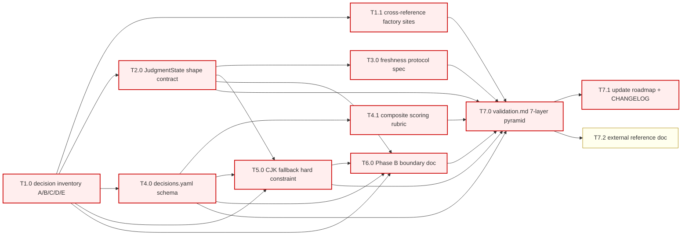

# Plan: Decision Architecture (Phase A)

This plan covers Phase A only.
Phase B (the `typesafe` adapter implementation and freshness `Noul` PoC) and Phase C (full per-agent migration) are referenced in `requirements.md` and will spawn follow-on specs.
This plan does NOT touch Phase 11 Slice A/B code; it lands as a documentation-only phase whose exit criteria are structural and content-based, not code-based.

The work is organised into seven groups that build the architecture document bottom-up: from the inventory of judgment points, through the state shape and freshness protocol, to the routing configuration, composite scoring, CJK fallback, validation, and the external reference doc.

## 0. Meta

- branch: `phase-2-decision-architecture`
- spec: `specs/2026-09-20-decision-architecture`
- parent_phase: Decision Architecture (Phase A — architecture spec only)
- test_runner: `npm test`
- dag_notation: mermaid

## 1. Dependency Graph (DAG)

> mermaid render fallback: §4 task table `deps` column.

## 2. Priority Legend

- **P0** — critical path: every task whose absence would prevent Phase A from being a complete architecture specification.
- **P1** — core reference: external documentation that aids human readers but does not block the spec from being machine-readable.
- **P2** — out of scope for Phase A; reserved for Phase B/C follow-on specs.

## 3. Parallelism Rule

- Default `parallel: safe` (independent files / sections, no race).
- **Shared schema or shared file** → `parallel: unsafe`.
- Phase A's groups write independent sections of `requirements.md`, plus one independent `plan.md`, one independent `validation.md`, plus updates to `specs/roadmap.md` and `CHANGELOG.md`.
- The roadmap and CHANGELOG edits in T7.1 are the only `unsafe` task; they touch the same files other specs also touch and must serialize against any in-flight roadmap / changelog work.

## 4. Task Groups

### G1: Decision Inventory (layer=arch)

| id | title | prio | layer | parallel | deps | effort | acceptance | test_layers |
|----|-------|------|-------|----------|------|--------|------------|-------------|
| T1.0 | [x] Write decision inventory tables A/B/C/D/E | P0 | arch | safe | — | M | `requirements.md` §"Decision Inventory" contains five tables A/B/C/D/E with all rows for the IDs listed in `requirements.md`; each row carries id, judgment, current site, primitive, backend, confidence, phase | unit (doc-spec) |
| T1.1 | [x] Cross-reference each judgment with current factory site (file:line) | P0 | arch | safe | T1.0 | S | Every row in A/B/C/D/E points to a verifiable `file_path:line` in the current tree; spot-checked by `npm run typecheck` (file:line references resolve to non-empty locations) | unit (doc-spec) |

### G2: State Shape Standardization (layer=arch)

| id | title | prio | layer | parallel | deps | effort | acceptance | test_layers |
|----|-------|------|-------|----------|------|--------|------------|-------------|
| T2.0 | [x] Write `JudgmentState` shape contract | P0 | arch | safe | T1.0 | M | `requirements.md` §"State Shape Contract" contains the TypeScript interface `JudgmentState` and the four rules (read-only, optional fields, single instance per batch, Phase B export plan); every primitive in the inventory references at least one field of `JudgmentState` | unit (doc-spec) |

### G3: Freshness Protocol (layer=arch)

| id | title | prio | layer | parallel | deps | effort | acceptance | test_layers |
|----|-------|------|-------|----------|------|--------|------------|-------------|
| T3.0 | [x] Write freshness protocol (state hash, staleness threshold, skip rule) | P0 | arch | safe | T2.0 | M | `requirements.md` §"Freshness Protocol" contains the hash definition formula, the `noul_yes < 0.2` threshold rule, the configurable knob in `decisions.yaml`, and the `judgment.skip` log event contract | unit (doc-spec) |

### G4: Routing Configuration (layer=arch)

| id | title | prio | layer | parallel | deps | effort | acceptance | test_layers |
|----|-------|------|-------|----------|------|--------|------------|-------------|
| T4.0 | [x] Write `decisions.yaml` schema | P0 | arch | safe | T1.0 | M | `requirements.md` §"`decisions.yaml` Schema" contains the YAML 1.2 schema with at least three example rows (`freshness.skip`, `triage.apply_label`, `review-pr.merge_pr`, `supervisor.retry`, `operator.escalate`), and the four schema validation rules | unit (doc-spec) |
| T4.1 | [x] Write composite scoring rubric + initial weights | P0 | arch | safe | T4.0 | S | `requirements.md` §"Composite Scoring Rubric" contains the four-dimension table (spec/impl/review/verify with weights 0.30/0.25/0.20/0.25 summing to 1.0 ±0.01) and the `< 0.5 / 0.5–0.7 / > 0.7` thresholds | unit (doc-spec) |

### G5: CJK Fallback Constraint (layer=arch)

| id | title | prio | layer | parallel | deps | effort | acceptance | test_layers |
|----|-------|------|-------|----------|------|--------|------------|-------------|
| T5.0 | [x] Document CJK fallback hard constraint | P0 | arch | safe | T1.0, T2.0, T4.0 | S | `requirements.md` §"CJK Fallback Contract" enumerates the three trigger conditions (network / 5xx, missing key, confidence below threshold), the three behaviour clauses (adapter return shape, graceful degradation, structured log fields), the four observability requirements, and the Phase B test contract | unit (doc-spec) |

### G6: Phase B Boundary Documentation (layer=arch)

| id | title | prio | layer | parallel | deps | effort | acceptance | test_layers |
|----|-------|------|-------|----------|------|--------|------------|-------------|
| T6.0 | [x] Write Phase B / Phase C explicit boundary | P0 | arch | safe | T1.0, T2.0, T4.0, T5.0 | S | `requirements.md` §"Out of Scope (Phase A → Phase B / C)" enumerates the seven deferred items with Phase B/C tagging, plus the four "Permanent Non-Goals" | unit (doc-spec) |

### G7: Validation, Roadmap, Reference (layer=integration)

| id | title | prio | layer | parallel | deps | effort | acceptance | test_layers |
|----|-------|------|-------|----------|------|--------|------------|-------------|
| T7.0 | [x] Write `validation.md` 7-layer pyramid | P0 | integration | safe | T1.1, T2.0, T3.0, T4.0, T4.1, T5.0, T6.0 | M | `validation.md` contains L1–L7 commands with `expect:` and `block:` flags; L4 maps every P0 task in §4; DoD checklist is fully populated | unit (doc-spec), integration |
| T7.1 | [x] Update `specs/roadmap.md` and `CHANGELOG.md` | P0 | integration | unsafe | T7.0 | S | `specs/roadmap.md` has a new `### Phase 12: Decision Architecture (Phase A)` entry with `Status: ⏳ In Flight (Phase A)`; `CHANGELOG.md` has an `Unreleased / Decision Architecture` heading listing Phase A deliverables; existing content is preserved (no deletion) | unit (doc-spec) |
| T7.2 | [x] External reference doc `docs/decision-architecture.md` | P1 | experience | safe | T7.0 | M | `docs/decision-architecture.md` exists with a human-reader-friendly summary of Decisions 1–8, a link to `specs/2026-09-20-decision-architecture/requirements.md`, and a diagram of the judgment/generation layer split | smoke |

## 5. Risks & Mitigations

- **R1 — Spec incompleteness at section level**: a missing row in any of the five inventory tables, or a `decisions.yaml` example without all required keys, fails L4 acceptance.
  *Mitigation*: T1.0 / T4.0 acceptance tests enumerate the required rows; T7.0's L4 layer maps to those tests.

- **R2 — Cross-reference rot**: every `file:line` reference can drift as factory code changes; the spec is then stale.
  *Mitigation*: T7.0's L1 unit test runs `node scripts/spec-lineage-check.mjs` (a one-shot script introduced by T7.0) that opens each referenced file and asserts the line still exists; CI runs it on every push.

- **R3 — Roadmap merge conflict**: T7.1's edits to `specs/roadmap.md` and `CHANGELOG.md` may race with other concurrent spec work.
  *Mitigation*: T7.1 is marked `unsafe`; spec-do serializes it against any other in-flight task touching those two files. The phase branch is dedicated so concurrent work is on a different branch.

- **R4 — Phase B spec spawn dependency**: Phase A's exit criteria assume Phase B will be spawned from this spec's "Out of Scope" section. If Phase B is spawned without reading requirements.md, the work will not be anchored to the architecture.
  *Mitigation*: `requirements.md` §"Relationship to Other Specs" explicitly names `specs/2026-09-16-unified-agent-runtime/requirements.md` as the contract Phase B must extend; the README cross-link in T7.2 makes the relationship explicit.

## 6. Pause / Resume Markers

- `<!--- Paused after T<x> -->` is reserved for `spec-do` to write when execution is paused mid-group.
- This plan ships with all Phase A tasks completed; pause markers are not expected during Phase A execution itself.

## 7. Worker Slice (used by spec-do)

For each task in §4, the worker prompt must include:

- The single row above.
- The matching paragraph from `requirements.md` (the section the task is extending or producing).
- The list of `test_layers` (mapped to `validation.md` layers L1–L7).
- The exact acceptance command(s) — for Phase A doc tasks the command is a structural assertion script (`scripts/spec-lineage-check.mjs` from T7.0), invoked from `npm test` so the regression gate covers it.
- The instruction to output `worker_report.md` with the exact diff + command output + (UI only) screenshot.

Phase A does not spawn workers in production; the worker slice is a contract `spec-do` would use IF the spec were re-executed in a CI bot.
For interactive execution in this conversation, the tasks are completed inline and the worker slice is informational.

---

## Group Status (will be filled by spec-do)

- G1 — completed (T1.0, T1.1)
- G2 — completed (T2.0)
- G3 — completed (T3.0)
- G4 — completed (T4.0, T4.1)
- G5 — completed (T5.0)
- G6 — completed (T6.0)
- G7 — completed (T7.0, T7.1, T7.2)
- Phase A exit criteria: all P0 tasks complete; L1 / L4 / L7 block=true pass.
