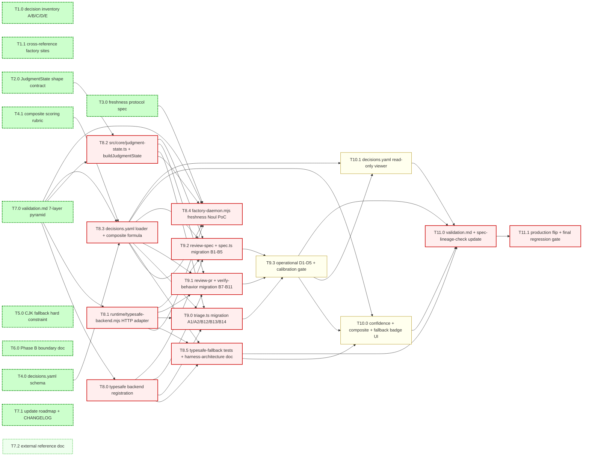

# Plan: Decision Architecture (Phase A)

This plan covers Phase A only.
Phase B (the `typesafe` adapter implementation and freshness `Noul` PoC) and Phase C (full per-agent migration) are referenced in `requirements.md` and will spawn follow-on specs.
This plan does NOT touch Phase 11 Slice A/B code; it lands as a documentation-only phase whose exit criteria are structural and content-based, not code-based.

The work is organised into seven groups that build the architecture document bottom-up: from the inventory of judgment points, through the state shape and freshness protocol, to the routing configuration, composite scoring, CJK fallback, validation, and the external reference doc.

## 0. Meta

- branch: `phase-2-decision-architecture-b-e`
- spec: `specs/2026-09-20-decision-architecture`
- parent_phase: Decision Architecture (Phases B–E — implementation, per-agent migration, UI, rollout)
- test_runner: `npm test`
- dag_notation: mermaid
- Phase A (architecture-only) is already merged on `main` and is the input contract for this phase.
- Phases B–E add code under `runtime/`, `src/core/`, `src/orchestrator/`, `src/agents/`, `scripts/`, `control-panel/`, and `docs/`.

## 1. Dependency Graph (DAG)

> mermaid render fallback: §4 task table `deps` column.
> Nodes tagged `done` (dashed green border) are Phase A tasks already merged on `main`; they appear as input contract anchors for the B-E DAG.

## 2. Priority Legend

- **P0** — critical path: every task whose absence would prevent Phases B–E from being a complete, shippable implementation of the architecture.
- **P1** — core reference: documentation, UI surfaces, calibration tests that aid human readers / operators but do not block the runtime from being machine-correct.
- **P2** — out of scope for Phases B–E; reserved for follow-on specs (e.g. multi-judge ensembling, A/B evaluation harness).

## 3. Parallelism Rule

- Default `parallel: safe` (independent files / sections, no race).
- **Shared schema or shared file** → `parallel: unsafe`.
- Phase B (G8): T8.0, T8.3, T8.4 all touch `agent-runtime.ts` / `agent-backends.mjs` / `factory-daemon.mjs`; T8.3 also touches the new `runtime/decisions.yaml` and `src/core/decisions.ts`; T8.4 also touches `FactoryIssueState`. These are marked `unsafe` to prevent race conditions in the dispatcher and the polling loop.
- Phase C (G9): T9.0, T9.1, T9.2 each touch a single agent file (or pair) and share only `judgment-state.ts` (which T8.2 already produced); they are `safe` to run in parallel.
- Phase D (G10): T10.0 and T10.1 touch independent files (`App.tsx` vs the new panel API endpoint); `safe`.
- Phase E (G11): T11.0 and T11.1 both touch `validation.md`, `CHANGELOG.md`, and shared integration scripts; `unsafe`.

## 4. Task Groups

### G1: Decision Inventory (layer=arch)

| id | title | prio | layer | parallel | deps | effort | acceptance | test_layers |
|----|-------|------|-------|----------|------|--------|------------|-------------|
| T1.0 | [x] Write decision inventory tables A/B/C/D/E | P0 | arch | safe | — | M | `requirements.md` §"Decision Inventory" contains five tables A/B/C/D/E with all rows for the IDs listed in `requirements.md`; each row carries id, judgment, current site, primitive, backend, confidence, phase | unit (doc-spec) |
| T1.1 | [x] Cross-reference each judgment with current factory site (file:line) | P0 | arch | safe | T1.0 | S | Every row in A/B/C/D/E points to a verifiable `file_path:line` in the current tree; spot-checked by `npm run typecheck` (file:line references resolve to non-empty locations) | unit (doc-spec) |

### G2: State Shape Standardization (layer=arch)

| id | title | prio | layer | parallel | deps | effort | acceptance | test_layers |
|----|-------|------|-------|----------|------|--------|------------|-------------|
| T2.0 | [x] Write `JudgmentState` shape contract | P0 | arch | safe | T1.0 | M | `requirements.md` §"State Shape Contract" contains the TypeScript interface `JudgmentState` and the four rules (read-only, optional fields, single instance per batch, Phase B export plan); every primitive in the inventory references at least one field of `JudgmentState` | unit (doc-spec) |

### G3: Freshness Protocol (layer=arch)

| id | title | prio | layer | parallel | deps | effort | acceptance | test_layers |
|----|-------|------|-------|----------|------|--------|------------|-------------|
| T3.0 | [x] Write freshness protocol (state hash, staleness threshold, skip rule) | P0 | arch | safe | T2.0 | M | `requirements.md` §"Freshness Protocol" contains the hash definition formula, the `noul_yes < 0.2` threshold rule, the configurable knob in `decisions.yaml`, and the `judgment.skip` log event contract | unit (doc-spec) |

### G4: Routing Configuration (layer=arch)

| id | title | prio | layer | parallel | deps | effort | acceptance | test_layers |
|----|-------|------|-------|----------|------|--------|------------|-------------|
| T4.0 | [x] Write `decisions.yaml` schema | P0 | arch | safe | T1.0 | M | `requirements.md` §"`decisions.yaml` Schema" contains the YAML 1.2 schema with at least three example rows (`freshness.skip`, `triage.apply_label`, `review-pr.merge_pr`, `supervisor.retry`, `operator.escalate`), and the four schema validation rules | unit (doc-spec) |
| T4.1 | [x] Write composite scoring rubric + initial weights | P0 | arch | safe | T4.0 | S | `requirements.md` §"Composite Scoring Rubric" contains the four-dimension table (spec/impl/review/verify with weights 0.30/0.25/0.20/0.25 summing to 1.0 ±0.01) and the `< 0.5 / 0.5–0.7 / > 0.7` thresholds | unit (doc-spec) |

### G5: CJK Fallback Constraint (layer=arch)

| id | title | prio | layer | parallel | deps | effort | acceptance | test_layers |
|----|-------|------|-------|----------|------|--------|------------|-------------|
| T5.0 | [x] Document CJK fallback hard constraint | P0 | arch | safe | T1.0, T2.0, T4.0 | S | `requirements.md` §"CJK Fallback Contract" enumerates the three trigger conditions (network / 5xx, missing key, confidence below threshold), the three behaviour clauses (adapter return shape, graceful degradation, structured log fields), the four observability requirements, and the Phase B test contract | unit (doc-spec) |

### G6: Phase B Boundary Documentation (layer=arch)

| id | title | prio | layer | parallel | deps | effort | acceptance | test_layers |
|----|-------|------|-------|----------|------|--------|------------|-------------|
| T6.0 | [x] Write Phase B / Phase C explicit boundary | P0 | arch | safe | T1.0, T2.0, T4.0, T5.0 | S | `requirements.md` §"Out of Scope (Phase A → Phase B / C)" enumerates the seven deferred items with Phase B/C tagging, plus the four "Permanent Non-Goals" | unit (doc-spec) |

### G7: Validation, Roadmap, Reference (layer=integration)

| id | title | prio | layer | parallel | deps | effort | acceptance | test_layers |
|----|-------|------|-------|----------|------|--------|------------|-------------|
| T7.0 | [x] Write `validation.md` 7-layer pyramid | P0 | integration | safe | T1.1, T2.0, T3.0, T4.0, T4.1, T5.0, T6.0 | M | `validation.md` contains L1–L7 commands with `expect:` and `block:` flags; L4 maps every P0 task in §4; DoD checklist is fully populated | unit (doc-spec), integration |
| T7.1 | [x] Update `specs/roadmap.md` and `CHANGELOG.md` | P0 | integration | unsafe | T7.0 | S | `specs/roadmap.md` has a new `### Phase 12: Decision Architecture (Phase A)` entry with `Status: ⏳ In Flight (Phase A)`; `CHANGELOG.md` has an `Unreleased / Decision Architecture` heading listing Phase A deliverables; existing content is preserved (no deletion) | unit (doc-spec) |
| T7.2 | [x] External reference doc `docs/decision-architecture.md` | P1 | experience | safe | T7.0 | M | `docs/decision-architecture.md` exists with a human-reader-friendly summary of Decisions 1–8, a link to `specs/2026-09-20-decision-architecture/requirements.md`, and a diagram of the judgment/generation layer split | smoke |

### G8: typesafe backend + freshness Noul PoC (Phase B — runtime layer)

| id | title | prio | layer | parallel | deps | effort | acceptance | test_layers |
|----|-------|------|-------|----------|------|--------|------------|-------------|
| T8.0 | [ ] Register `typesafe` in BACKEND_DESCRIPTORS + agent-backends.mjs | P0 | runtime | unsafe | T7.0 | M | `BACKEND_DESCRIPTORS` in `src/core/agent-runtime.ts` has a `typesafe` row with `displayName: "typesafe.ai Jev"`, `capabilities: { readOnly: true }`, `schemaVersion: 1`, `buildHash: env.FACTORY_BUILD_HASH ?? "dev"`; `agent-backends.mjs::resolveAgentConfig` accepts `TYPESAFE_API_KEY` from env, exposes `FACTORY_TYPESAFE_OFF` toggle (default 0), validates `FACTORY_TYPESAFE_COMMAND`; `agentWorkerEnvironment` forwards `TYPESAFE_API_KEY` when typesafe is selected; startup pre-check fails on unknown `FACTORY_AGENT_BACKEND=typesafe-without-registration`; `READ_ONLY_ROLES` remains unchanged (typesafe is read-only) | unit (agent-runtime-typesafe), api |
| T8.1 | [ ] `runtime/typesafe-backend.mjs` + `.d.mts` HTTP adapter | P0 | runtime | safe | T8.0 | L | `runtime/typesafe-backend.mjs` exports `runTypesafeStageFromConfig`; the module POSTs to `https://api.typesafe.ai/v1/systemone` with `{ model, state_hash, primitives: [{ id, type, question, state }] }`; on 4xx/5xx/timeout/missing-key returns `StageRunResult` with `status: "failed"`, `warnings: ["typesafe_fallback_to_claude: <reason>"]`, `retryable: false`; honours `FACTORY_TYPESAFE_OFF=1` short-circuit; CLI session is mock-only (no real session id surfaced yet); `runtime/typesafe-backend.d.mts` declares the typed request/result envelope | unit (typesafe-backend), api |
| T8.2 | [ ] `src/core/judgment-state.ts` + `buildJudgmentState` helper | P0 | runtime | safe | T7.0, T2.0 | M | `src/core/judgment-state.ts` exports the `JudgmentState` TypeScript interface from `requirements.md` §"State Shape Contract" verbatim; `buildJudgmentState(issue, ctx, opts)` lazily populates `issue / factory / repoSignals / roadmap / prDiff / specBody / implementationDiff`; `stateHashFor(state)` computes the SHA-256 defined in `requirements.md` §"Freshness Protocol"; no runtime behaviour change to existing callers (additive helper) | unit (judgment-state) |
| T8.3 | [ ] `runtime/decisions.yaml` + `loadDecisions` + `validateDecisions` + composite formula | P0 | runtime | unsafe | T7.0, T4.0, T4.1 | M | `runtime/decisions.yaml` exists with all five example rows from §4 of `requirements.md` plus `composite` and `fallback` blocks; `src/core/decisions.ts` exports `loadDecisions()` (reads + parses YAML) and `validateDecisions(decisions)` enforcing `confidence_min <= confidence_max`, weights sum to `1.0 ± 0.01`, every `action` in `READ_ONLY_ACTIONS` closed set; `src/orchestrator/composite.ts` exports `computeHealth(state)` returning `[0.0, 1.0]` per Decision 6 weights; `decisions.ts` is wired into the runtime startup pre-check (unknown action ⇒ startup failure identical in severity to F01 load_skill regression) | unit (decisions-validate), api |
| T8.4 | [ ] `factory-daemon.mjs` freshness Noul PoC | P0 | runtime | unsafe | T7.0, T3.0, T8.1, T8.2, T8.3 | L | The polling loop in `scripts/factory-daemon.mjs::pollingLoop` (currently L1416–L1433) inserts a `freshnessCheck(issue)` step between `fetchNextIssue()` and `enqueueIssue(issue)`; when `noul_yes < threshold` it logs `judgment.skip` with `reason: "state_unchanged"` and `stateHash` + `noul_yes`, then continues to next issue without enqueueing; the `FactoryIssueState.lastJudgmentHash` is updated on every skip; composite `health` is computed once per cycle and attached to the `daemon-tick` log; the existing `process-issue-start` / `process-issue-end` lifecycle is preserved unchanged | unit (freshness-poc), smoke |
| T8.5 | [ ] `typesafe-fallback.test.ts` + `typesafe-fallback-cli.test.mjs` + `docs/harness-architecture.md` update | P0 | runtime+integration | safe | T8.1, T8.3, T8.0 | M | `src/__tests__/typesafe-fallback.test.ts` covers all three trigger conditions (network/4xx/5xx, missing `TYPESAFE_API_KEY`, confidence below threshold) per `requirements.md` §"CJK Fallback Contract" §4; `test/typesafe-fallback-cli.test.mjs` confirms `FACTORY_TYPESAFE_OFF=1` forces fallback regardless of API health for offline testing; `docs/harness-architecture.md` gains a "Decision Architecture" subsection naming the `typesafe` adapter location, the freshness protocol step, and the `decisions.yaml` schema | unit (typesafe-fallback), cli, smoke |

### G9: Per-agent judgment migration (Phase C — wiring)

| id | title | prio | layer | parallel | deps | effort | acceptance | test_layers |
|----|-------|------|-------|----------|------|--------|------------|-------------|
| T9.0 | [ ] `triage.ts` migration (A1, A2, A3, B12, B13, B14) | P0 | agents | safe | T8.0, T8.1, T8.2, T8.3 | L | `src/agents/triage.ts` runs the freshness `Noul` (A1) before any other primitive; replaces the implicit single LLM call with a `typesafe` batch call carrying `{ A2: Choice×1 + Noul×1, A3: Noul×1, B12: Choice×1, B13: Score×1, B14: Noul×1 }` over a shared `JudgmentState`; routes via `decisionRouter.apply('triage.apply_label', result)` per `decisions.yaml`; existing `parse()` is preserved as a fallback path; supervisor action and complexity land on the same state | unit (triage-typesafe), feature |
| T9.1 | [ ] `review-pr.ts` + `verify-behavior.ts` migration (B7, B8, B9, B10, B11) | P0 | agents | safe | T8.0, T8.1, T8.2, T8.3 | L | `src/agents/review-pr.ts` runs B7 (`Choice`) + B8 (`Choice × M findings`) on the shared state via `typesafe` batch; `src/agents/verify-behavior.ts` runs B9 (5-way `Choice`), B10 (3-way `Choice`), B11 (`Noul × N` per AC) on the same state; both agents preserve their existing `OutputContract` parsers as the fallback path; both run inside the existing dispatchAgentStage envelope; `review-pr.merge_pr` action consults `decisions.yaml` to decide auto/confirm/escalate | unit (review-pr-typesafe), feature |
| T9.2 | [ ] `review-spec.ts` + `spec.ts` migration (B1, B2, B3, B4, B5) | P0 | agents | safe | T8.0, T8.1, T8.2, T8.3 | L | `src/agents/spec.ts` runs B1 (`Choice` PRODUCT vs PRODUCT+TECH), B2 (`Score × N ACs` completeness), B3 (`Noul × N ACs` verifiability) on a shared `JudgmentState`; `src/agents/review-spec.ts` runs B4 (verdict `Choice`) + B5 (per-finding severity `Choice × M`) on the same shared state with the spec body available; both preserve their existing `OutputContract` parsers as fallback; the `ev` batch is one HTTP request, not N | unit (spec-typesafe), feature |
| T9.3 | [ ] Operational judgments (D1–D5) + calibration acceptance gate | P1 | integration | unsafe | T9.0, T9.1, T9.2 | L | `runtime/panel-read-model.mjs` aggregates D1 (pipeline bottleneck `Score`), D2 (systemic-failure `Noul`), D3 (operator escalation `Noul`), D4 (backpressure `Noul × 3`), D5 (skill suggestion `Choice`); `scripts/typesafe-calibration.mjs` runs 100 sample issues from a frozen test fixture, computes Jev confidence P50/P90 per dimension, asserts stability within ±0.05 across re-runs; the calibration script exits 0 on PASS and 1 on FAIL with a per-issue report | integration (calibration) |

### G10: UI changes (Phase D — control-panel)

| id | title | prio | layer | parallel | deps | effort | acceptance | test_layers |
|----|-------|------|-------|----------|------|--------|------------|-------------|
| T10.0 | [ ] Confidence + composite health + fallback badge in `control-panel/src/App.tsx` | P1 | experience | safe | T9.3, T8.3, T8.5 | M | `control-panel/src/App.tsx` renders (a) a confidence distribution chart per stage run (small histogram / sparkline keyed on the run id), (b) a `health` composite badge next to per-issue status with the `< 0.5 / 0.5–0.7 / > 0.7` colour bands from Decision 6, (c) a fallback badge on any stage whose last run was a `typesafe_fallback_to_claude`; the `panel-read-model.mjs` shape is extended with the new fields without breaking existing consumers; `npm run build:panel` exits 0 | ui, smoke |
| T10.1 | [ ] `decisions.yaml` read-only viewer in control-panel | P1 | experience | safe | T9.3, T8.3 | M | The control-panel exposes a "Routing Configuration" page that fetches the current `decisions.yaml` (served by `runtime/decisions.yaml` via the panel API) and renders each action's `auto / confirm / escalate` thresholds; the viewer is read-only (no editing in this phase); `panel-api.mjs` gains one new endpoint `GET /api/decisions` returning the parsed YAML as JSON | ui, smoke |

### G11: Production rollout + regression gate (Phase E)

| id | title | prio | layer | parallel | deps | effort | acceptance | test_layers |
|----|-------|------|-------|----------|------|--------|------------|-------------|
| T11.0 | [ ] Update `validation.md` L1–L7 + `scripts/spec-lineage-check.mjs` track B/C/D/E + `CHANGELOG.md` | P0 | integration | unsafe | T10.0, T10.1, T9.3, T8.5 | M | `validation.md` adds L1 commands for the new tests (`typesafe-fallback`, `judgment-state`, `decisions-validate`, `freshness-poc`, `triage-typesafe`, `review-pr-typesafe`, `spec-typesafe`, `calibration`); L3 smoke adds `npm run build:panel`; L4 feature maps every new P0/P1 task; L7 integration tracks the cross-spec consistency checks (BACKEND_DESCRIPTORS now contains `typesafe`; agent-runtime dispatcher still preserves Slice C contract); `scripts/spec-lineage-check.mjs` gains B/C/D/E checks (every judgment ID migrated, every UI page present, every doc section present); `CHANGELOG.md` adds Phase B/C/D/E entries under `Unreleased / Decision Architecture`; existing Phase A entries preserved | unit (spec-lineage), integration |
| T11.1 | [ ] Production flip + final regression gate | P0 | integration | unsafe | T11.0 | M | `runtime/decisions.yaml` defaults the three highest-volume action rows (`freshness.skip`, `triage.apply_label`, `review-pr.merge_pr`) to `auto` with their documented thresholds (no opt-in required); the daemon's `enqueueIssue` path is gated by `FACTORY_DECISIONS_ENABLED=1` with default 1; a `npm run regression:b-e` script runs `npm test` + `npm run test:cli` + `npm run build:panel` + `npm run spec-check` + the calibration script on a synthetic 10-issue fixture and exits 0; the L7 block holds the merge | integration (regression), ui, smoke |

## 5. Risks & Mitigations

- **R1 — Spec incompleteness at section level**: a missing row in any of the five inventory tables, or a `decisions.yaml` example without all required keys, fails L4 acceptance.
  *Mitigation*: T1.0 / T4.0 acceptance tests enumerate the required rows; T7.0's L4 layer maps to those tests.

- **R2 — Cross-reference rot**: every `file:line` reference can drift as factory code changes; the spec is then stale.
  *Mitigation*: T7.0's L1 unit test runs `node scripts/spec-lineage-check.mjs` (a one-shot script introduced by T7.0) that opens each referenced file and asserts the line still exists; CI runs it on every push.

- **R3 — Roadmap merge conflict**: T7.1's edits to `specs/roadmap.md` and `CHANGELOG.md` may race with other concurrent spec work.
  *Mitigation*: T7.1 is marked `unsafe`; spec-do serializes it against any other in-flight task touching those two files. The phase branch is dedicated so concurrent work is on a different branch.

- **R4 — Phase B spec spawn dependency**: Phase A's exit criteria assume Phase B will be spawned from this spec's "Out of Scope" section. If Phase B is spawned without reading requirements.md, the work will not be anchored to the architecture.
  *Mitigation*: `requirements.md` §"Relationship to Other Specs" explicitly names `specs/2026-09-16-unified-agent-runtime/requirements.md` as the contract Phase B must extend; the README cross-link in T7.2 makes the relationship explicit.

- **R5 — typesafe.ai endpoint availability**: `api.typesafe.ai/v1/systemone` may be unreachable from the CI / sandbox environment; an unreachable endpoint would block all of T8.1 / T8.4 / T9.x.
  *Mitigation*: every `typesafe` call short-circuits when `FACTORY_TYPESAFE_OFF=1` is set (Phase B's CJK fallback contract already requires this); tests set it explicitly. The CI smoke test verifies fallback behaviour rather than live API success. Calibration gate (T9.3) runs against a frozen fixture, not live API.

- **R6 — Dispatcher regression in Phase B**: T8.0 widens `BACKEND_DESCRIPTORS` and `agent-backends.mjs`; an incorrect edit could break the existing Claude Code path that the six-agent pipeline currently relies on.
  *Mitigation*: T8.0 acceptance test runs the existing `npm run test:cli` against the untouched `claude-code` role set; the test must pass before T8.0 marks complete. T8.5's `typesafe-fallback-cli.test.mjs` independently verifies the dispatcher wires `FACTORY_TYPESAFE_OFF` through without disturbing `claude-code`.

- **R7 — Polling-loop regression in T8.4**: factory-daemon.mjs::pollingLoop is the hot path; a bad freshness Noul gate could starve the worker pool.
  *Mitigation*: T8.4 acceptance includes `npm run test:cli` plus a dedicated smoke that runs the daemon for 60 s with `FACTORY_TYPESAFE_OFF=1` (so every issue is enqueued) and asserts ≥ 1 `process-issue-start` log; the L1 unit test mocks `freshnessCheck` and asserts the original `fetchNextIssue → enqueueIssue` flow still works when the freshness module throws.

- **R8 — Per-agent migration regression (Phase C)**: T9.x rewrites the prompt structure of triage / review-pr / verify-behavior / spec / review-spec; if the new `typesafe` batch returns a different shape than the existing `parse()` expects, every pipeline run could fail.
  *Mitigation*: each T9.x task keeps the existing `parse()` as the fallback path; the `OutputContract` is unchanged; the new `typesafe` batch returns the same shape with an extra `confidence` field. Tests assert both code paths produce structurally identical `TriageResult` / `ReviewResult` / `BehaviorVerificationResult` etc.

- **R9 — UI pixel regression (Phase D)**: T10.0/T10.1 add new components to `control-panel/src/App.tsx`; a layout regression could break the existing operator dashboard.
  *Mitigation*: T10.0 acceptance includes `npm run build:panel` plus a render smoke that asserts the existing issue list and pipeline status panel still render at the same width; new components are added below the existing flow, not interleaved.

- **R10 — Production flip blast radius (Phase E)**: T11.1 flips defaults in `runtime/decisions.yaml`; a misconfigured threshold could change behaviour for every operator on the next poll.
  *Mitigation*: T11.1 is gated by `FACTORY_DECISIONS_ENABLED=1` with default 1 (so operators must explicitly opt out by setting `0`); the regression script runs against a synthetic fixture and the L1 / L3 / L7 layers must all pass before merge.

## 6. Pause / Resume Markers

- `<!--- Paused after T<x> -->` is reserved for `spec-do` to write when execution is paused mid-group.
- Phase A ships complete; no pause markers were written during Phase A execution.
- Phases B–E expect pause markers around G8 → G9 → G10 → G11 transitions because each group introduces a new runtime surface (the polling loop in G8, the agent migration in G9, the UI in G10, the production flip in G11). spec-do writes one marker per group boundary it crosses.

## 7. Worker Slice (used by spec-do)

For each task in §4, the worker prompt must include:

- The single row above.
- The matching paragraph from `requirements.md` (the section the task is extending or producing).
- The list of `test_layers` (mapped to `validation.md` layers L1–L7).
- The exact acceptance command(s) — for Phase B runtime tasks the command is the existing `npm test` plus the new module-level test files introduced by T8.x / T9.x.
- The instruction to output `worker_report.md` with the exact diff + command output + (UI only) screenshot.

Phases B–E are interactive execution; `spec-do` schedules them via the worktree pool (≤4 workers), merges each task back with `--no-ff`, and updates `.do_state.json` after every task.

---

## Group Status (will be filled by spec-do)

- G1 — completed (T1.0, T1.1)
- G2 — completed (T2.0)
- G3 — completed (T3.0)
- G4 — completed (T4.0, T4.1)
- G5 — completed (T5.0)
- G6 — completed (T6.0)
- G7 — completed (T7.0, T7.1, T7.2)
- G8 — pending (T8.0, T8.1, T8.2, T8.3, T8.4, T8.5)  ← Phase B runtime layer
- G9 — pending (T9.0, T9.1, T9.2, T9.3)              ← Phase C per-agent migration
- G10 — pending (T10.0, T10.1)                       ← Phase D UI
- G11 — pending (T11.0, T11.1)                       ← Phase E production rollout
- Phase A exit criteria: all P0 tasks complete; L1 / L4 / L7 block=true pass.
- Phase B–E exit criteria: all P0 + P1 tasks complete; L1 / L3 / L4 / L7 block=true pass; calibration script exits 0; `npm run regression:b-e` exits 0.
